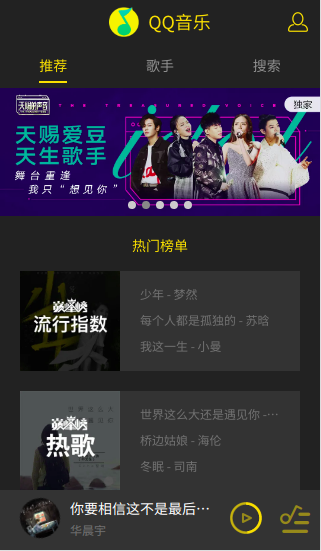
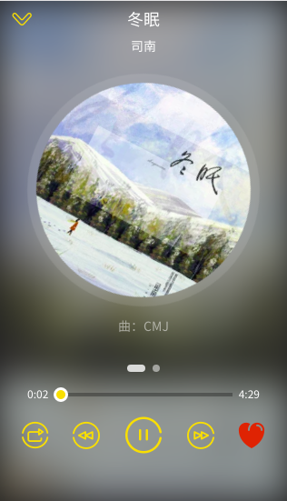
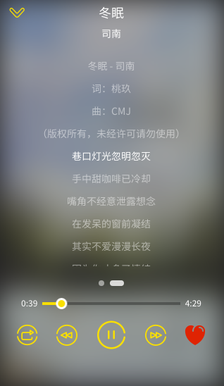

# Angular Music

使用Angular9编写的音乐播放器，所有接口抓取自QQ音乐

### 2020-3-20  
增加了qq登陆  
后台服务项目：[https://github.com/timoodada/music-server](https://github.com/timoodada/music-server)

[演示地址](http://49.235.160.182:83/)

